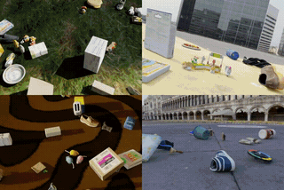

# Kubric-5D

Synthetic multi-view dynamic scenes with dense camera trajectories, built for the **AnyView** project.

[AnyView project page](https://tri-ml.github.io/AnyView/) | [AnyView paper](https://tri-ml.github.io/AnyView/AnyView.pdf) | [AnyView-DVS code and models](https://github.com/TRI-ML/AnyView-DVS) | Data license: [CC BY 4.0](https://creativecommons.org/licenses/by/4.0/) | Code license: [CC BY-NC 4.0](https://creativecommons.org/licenses/by-nc/4.0/)



Kubric-5D is a dataset of 10,000 procedurally generated, physically simulated scenes, each rendered as 16 synchronized videos from cameras that move on a wide variety of trajectories. It is one of the datasets used to train and evaluate AnyView, and its test split holds the Kubric-5D episodes of AnyViewBench. This repository holds the published dataset (download links below) and the code that generated it.

Compared to Kubric-4D (the dataset of [GCD](https://github.com/basilevh/gcd)), Kubric-5D adds camera trajectory diversity (16 trajectory types with randomized phase, direction and velocity, including dolly zoom), focal length variation, and color managed rendering with Blender's Filmic configuration.

## Dataset

### Scenes

- 10,000 scenes, `scn00000` to `scn09999`, generated independently of each other.
- 16 cameras per scene, `cam00` to `cam15`, all pointed at the scene center from a sphere of radius 15 m (10 to 18 m for trajectories that change their distance), with starting azimuths spread evenly around the center. In the static layout 4 cameras sit at 45 degrees elevation and 12 at 5 degrees. One scene, `scn01446`, has 10 cameras.
- 60 frames per camera at 24 fps, 576x384 pixels (width x height), rendered with 32 samples per pixel and no motion blur.
- Every camera draws its own trajectory type from 16 types, named by their code names in the generator: `fixed` (static), `orbit`, `radial`, `elevate`, `pan_straight`, `pan_centered`, `nautilus_centered`, `nautilus_straight`, `nautilus_straight_roll_cnst`, `nautilus_straight_roll_up`, `sine_centered`, `sine_centered_roll`, `sine_straight`, `sine_straight_roll`, `dolly`, and `lissajous`. `centered` trajectories keep looking at the scene center, `straight` ones look along the direction of travel, `roll` ones add camera roll. Direction of travel and whether the distance grows or shrinks are drawn at random per camera. `fixed`, `orbit`, `radial`, `elevate`, the two `pan` types and `lissajous` are drawn more often than the others.
- Focal length: sensor width 32 mm and one of three modes per scene, `fixed_const` (32 mm for every camera), `rand_const` (one random value between 24 and 40 mm shared by all cameras) or `rand_vary` (a random value between 24 and 40 mm per camera). The `dolly` trajectory also animates the focal length during the clip (longer while moving away, shorter while moving in), which gives a dolly zoom.
- Objects: Google Scanned Objects assets on an HDRI Haven background dome, simulated with PyBullet using per asset mass estimates. Each scene is either `centered` or `scattered`: 6 to 16 (centered) or 10 to 24 (scattered) static objects are dropped and settle for 4 seconds of simulation, then 1 to 6 (centered) or 6 to 12 (scattered) dynamic objects are thrown in with random velocities biased toward the center. The spawn area is wider for scattered scenes, and object sizes range from 1.0 to 2.75 m.

The raw output of the generator holds, per camera, RGB, depth, surface normals, forward optical flow, segmentation and 3D object coordinates, plus a small JSON with the trajectory settings of that camera. The published archives hold RGB and cameras only; depth is not part of the published archives and can be regenerated with this code. The internal copy with depth is about 4.8 TB.

### Published layout

Every scene is one directory in the unified scene layout (videos variant), the same layout AnyView-DVS reads:

```
scn00042/
  metadata.json          scene info: name, cameras, resolution [384, 576], num_frames 60, framerate 24
  rgb/cam00.mp4 ...      one video per camera, 60 frames
  lowdim/cam00.npz ...   per camera arrays: intrinsics (60, 3, 3), extrinsics (60, 4, 4) as cam2world, camera, timestep
```

Row i of the lowdim arrays belongs to frame i of the video. Intrinsics are pinhole matrices in pixels at 576x384.

### Split

| split | scenes | archives |
| --- | --- | --- |
| train | `scn00000` to `scn09599` (9,600) | `Kubric5D_train_part00.tar.gz` to `Kubric5D_train_part09.tar.gz`, 960 scenes each in scene order |
| val | `scn09600` to `scn09799` (200) | `Kubric5D_val.tar.gz` |
| test | `scn09800` to `scn09999` (200) | `Kubric5D_test.tar.gz` |

The 64 Kubric-5D episodes of AnyViewBench are clips of test scenes `scn09800` to `scn09863`.

### Download

All files are under `https://s3.us-east-1.amazonaws.com/tri-ml-public.s3.amazonaws.com/datasets/anyview/`:

- `Kubric5D_tiny.tar.gz`: 100 training scenes for trying the finetuning script, 2.2 GB, extracts to `Kubric5D_tiny/`
- `Kubric5D_val.tar.gz`: 200 scenes, 4.32 GB, extracts to `Kubric5D_val/`
- `Kubric5D_test.tar.gz`: 200 scenes, 4.25 GB, extracts to `Kubric5D_test/`
- `Kubric5D_train_part00.tar.gz` to `Kubric5D_train_part09.tar.gz`: 960 scenes each in scene order, 20.5 to 20.8 GB each (207 GB in total), all extract into `Kubric5D_train/`
- `Kubric5D_index.json`: every archive with its size, sha256 and scene range

Each archive has a `.sha256` file next to it. With the AnyView-DVS repository, `python scripts/download.py --tier Kubric5D --out data/` fetches and verifies everything (216 GB) and `--only` selects archives by name pattern. The plain shell equivalent, followed by extraction (the train parts all land in `data/Kubric5D_train/`):

```bash
(
set -e
mkdir -p data && cd data
for f in Kubric5D_val Kubric5D_test Kubric5D_train_part0{0..9}; do
    curl -fLO https://s3.us-east-1.amazonaws.com/tri-ml-public.s3.amazonaws.com/datasets/anyview/$f.tar.gz
    curl -fLO https://s3.us-east-1.amazonaws.com/tri-ml-public.s3.amazonaws.com/datasets/anyview/$f.tar.gz.sha256
    sha256sum -c $f.tar.gz.sha256
done
for f in Kubric5D_*.tar.gz; do tar xzf $f; done
)
```

## Generation code

| Path | Description |
| --- | --- |
| `data-gen/generate.sh` | Entry point: sets the environment and runs the generator with the dataset settings. |
| `data-gen/export_kub_mv.py` | Multi-view scene generator: object placement, camera trajectories, rendering, export. |
| `data-gen/kubric_sim.py`, `kubric_constants.py`, `data_utils.py` | Simulator and renderer wrapper around Kubric, asset lists, helpers. |
| `data-gen/kubric_custom/` | Vendored Google Research Kubric (Apache 2.0) with a fix for a race condition in depth handling. |
| `data-gen/colormanagement/` | Blender Filmic OpenColorIO configuration and LUTs used for tonemapping. |
| `data-gen/gpt_mass_v4.txt` | Per asset mass estimates used by the physics simulation. |

### Setup

Tested with Python 3.10. Install the OpenEXR system library ([instructions](https://openexr.com/en/latest/install.html)), then:

```bash
conda create -n kubric5d python=3.10
conda activate kubric5d
pip install bpy==3.4.0 --extra-index-url https://download.blender.org/pypi/
pip install pybullet OpenEXR
cd data-gen/kubric_custom/ && pip install -e . -c constraints.txt
```

`data-gen/kubric_custom` is [this commit](https://github.com/google-research/kubric/commit/e140e24e078d5e641c4ac10bf25743059bd059ce) of Google Research Kubric with a small fix for a race condition in depth handling; `constraints.txt` pins the dependency versions. The `requirements*.txt` files still list some dependencies of the original GCD code base.

### Usage

`data-gen/generate.sh` sets the environment variables and renders scenes with the dataset settings (16 cameras, 576x384, 60 frames at 24 fps, 32 samples per pixel, depth and object coordinates saved):

```bash
cd data-gen/
bash generate.sh [START_IDX] [END_IDX] [SEED]    # defaults 0, 99999, 9000
```

Edit `--root_dp` in the script to point at your output directory; it will contain `scn00000`, `scn00001`, and so on. `OCIO` points Blender at the Filmic configuration. Generation is CPU and memory heavy, and Blender fills `/tmp` between batches, so the script is meant to be restarted in batches. See `export_kub_mv.py` for all parameters (trajectory type, focal mode, object placement and counts can all be forced from the command line) and for the trajectory logic. A converter from the raw renders to the published layout is planned as a follow-up.

## Licensing

- **Kubric-5D dataset** (the published archives): [CC BY 4.0](https://creativecommons.org/licenses/by/4.0/).
- **Kubric-5D generation code** (the files authored for this project: the contents of `data-gen/` excluding `data-gen/kubric_custom/`): [CC BY-NC 4.0](https://creativecommons.org/licenses/by-nc/4.0/). See [`LICENSE`](LICENSE).
- **`data-gen/kubric_custom/`**: Google Research Kubric, [Apache 2.0](https://www.apache.org/licenses/LICENSE-2.0) (see `data-gen/kubric_custom/LICENSE`).
- **`data-gen/colormanagement/`**: Blender Filmic OpenColorIO configuration by Troy Sobotka (see `data-gen/colormanagement/ocio-license.txt`).

See [`NOTICE`](NOTICE) for third party attributions.

## Citations

If you use the Kubric-5D dataset or this code, please cite AnyView:
```
@inproceedings{vanhoorick2026anyview,
  title={AnyView: Synthesizing Any Novel View in Dynamic Scenes},
  author={Van Hoorick, Basile and Chen, Dian and Iwase, Shun and Tokmakov, Pavel and Irshad, Muhammad Zubair and Vasiljevic, Igor and Gupta, Swati and Cheng, Fangzhou and Zakharov, Sergey and Guizilini, Vitor Campagnolo},
  booktitle={European Conference on Computer Vision (ECCV)},
  year={2026}
}
```

And the underlying Kubric framework:
```
@inproceedings{greff2022kubric,
    title={Kubric: a scalable dataset generator},
    author={Klaus Greff and Francois Belletti and Lucas Beyer and Carl Doersch and Yilun Du and Daniel Duckworth and David J Fleet and Dan Gnanapragasam and Florian Golemo and Charles Herrmann and others},
    booktitle={IEEE Conference on Computer Vision and Pattern Recognition (CVPR)},
    year={2022}
}
```

## Acknowledgments

- [Kubric](https://github.com/google-research/kubric) (Google Research) for the scene generation framework.
- [Filmic Blender](https://github.com/sobotka/filmic-blender) (Troy Sobotka) for the color management configuration.
- [TCOW](https://tcow.cs.columbia.edu/) for the multi-view Kubric scene design that Kubric-4D and Kubric-5D build on.
- [GCD](https://github.com/basilevh/gcd) for the Kubric-4D generation pipeline that this code base builds on.
